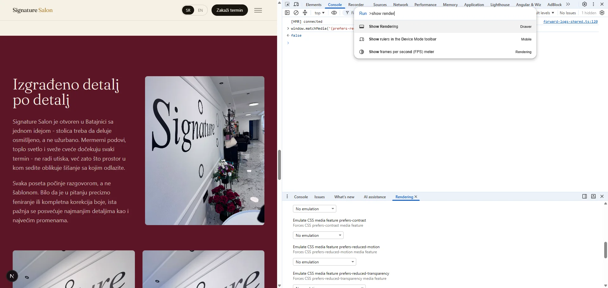

This is a [Next.js](https://nextjs.org) project bootstrapped with [`create-next-app`](https://nextjs.org/docs/app/api-reference/cli/create-next-app).

## Getting Started

First, run the development server:

```bash
npm run dev
# or
yarn dev
# or
pnpm dev
# or
bun dev
```

Open [http://localhost:3000](http://localhost:3000) with your browser to see the result.

You can start editing the page by modifying `app/page.tsx`. The page auto-updates as you edit the file.

This project uses [`next/font`](https://nextjs.org/docs/app/building-your-application/optimizing/fonts) to automatically optimize and load [Geist](https://vercel.com/font), a new font family for Vercel.

## Learn More

To learn more about Next.js, take a look at the following resources:

- [Next.js Documentation](https://nextjs.org/docs) - learn about Next.js features and API.
- [Learn Next.js](https://nextjs.org/learn) - an interactive Next.js tutorial.

You can check out [the Next.js GitHub repository](https://github.com/vercel/next.js) - your feedback and contributions are welcome!

## Deploy on Vercel

The easiest way to deploy your Next.js app is to use the [Vercel Platform](https://vercel.com/new?utm_medium=default-template&filter=next.js&utm_source=create-next-app&utm_campaign=create-next-app-readme) from the creators of Next.js.

Check out our [Next.js deployment documentation](https://nextjs.org/docs/app/building-your-application/deploying) for more details.

## TODO:

```txt
todo: maybe aggregaterating/review? we have business show on google maps ( seo + practical value )
```

## Documentation

- Get python: <https://www.python.org/>
- Get pnpm: <https://pnpm.io/>

Test static website build locally

```txt
# Build the static website
pnpm build

# Go to output directory of the static website
cd out

# Run python http server to serve the static website
py -3.14 -m http.server 8000
```

### Reduced motion test

On Windows, here is how it looks in browser



Steps to enable/disable reduced motion in Chrome

```txt
# Press
ctrl+shift+p

# Type and press enter
show rendering

# Find 'Emulate CSS media feature prefers-reduced-motion'
prefers-reduced-motion: reduce

# In browser console type
window.matchMedia('(prefers-reduced-motion: reduce)').matches

# You should see output 'true'

# Expect the motion (transition) not to happen, opacity transition will occur
```

### Optimize commited docs image

The following set of steps works on windows and allows us to optimize an image so we don't commit large unoptimized images to the repository.

```txt
# Set the two variables in powershell

$ImageName = "prefer-reduced-motion"
$ImageExt = "png"

# Create directory for optimized image

mkdir docs/optimized -ErrorAction SilentlyContinue

# Optimize the desired image

npx sharp-cli -i "docs/$ImageName.$ImageExt" -o "docs/optimized/$ImageName.webp" -f webp -q 85

# Check optimization result

Get-Item "docs/optimized/$ImageName.webp" | Select-Object Name, @{N='SizeKB';E={[math]::Round($_.Length/1KB,1)}}
```

At the end, replace the original image with the optimized `webp` image if desired result is satisfying.

### Testing metadata tags, image, description, title

Visit this url and paste the link to the website to test metadata tags.

<https://metatags.io/?url=signaturesalon.rs>
